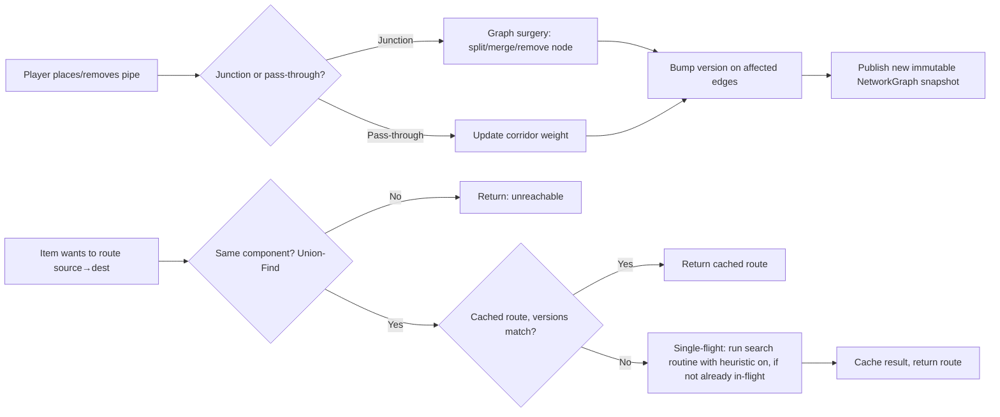

# Junction-Graph Routing Engine — Developer Guide

## Why this design, in one paragraph

Logistics-pipe networks are, structurally, road/utility networks: a large number of
low-value "corridor" segments connecting a much smaller number of decision points
(junctions). Full per-block pathfinding recomputed on every edit is what makes large
networks slow. The fix used here mirrors what road-network routing engines do at
continent scale (see "Further reading" below): compress the graph down to the nodes
that actually matter, cache routes between them, and only recompute the specific piece
of the graph that an edit actually touched — lazily, only when something asks for it.

## Core concepts glossary

- **Junction node**: a pipe with routing significance (a branch, or a pipe that's
  itself a provider/requester endpoint). Everything else — straight runs, dead-end
  transport pipe — gets compressed into edge weights and never appears as a node.
- **Corridor edge**: the compressed weight (distance/cost) of a run of plain pipe
  between two junctions.
- **Edge version**: a counter on each `CorridorEdge`, bumped any time that edge's
  weight changes or it's replaced (split/merged). This is the whole invalidation
  mechanism — no chunk-wide or network-wide "dirty" flags needed.
- **Single-flight**: a concurrency pattern where multiple simultaneous requests for the
  same not-yet-cached value are collapsed into one in-flight computation that all
  callers await, instead of each starting redundant work. Named after Go's
  `singleflight` package; the same idea shows up as request coalescing in HTTP caches.
- **Union-Find (Disjoint Set Union)**: a data structure that answers "are these two
  nodes in the same connected component?" in near-constant time, and can merge/split
  components incrementally. Used here as a cheap pre-check before bothering to search
  for a path at all.
- **A\* is Dijkstra plus a heuristic**: A* orders its priority queue by
  `distanceSoFar + heuristic(node, goal)` instead of just `distanceSoFar`. Set the
  heuristic to zero everywhere and the algorithm degenerates exactly to Dijkstra. This
  is why the engine implements one search routine rather than two — see "One core
  routine" below.
- **Admissible / consistent heuristic**: admissible means the heuristic never
  overestimates the true remaining cost (so the search never rules out the actual
  shortest path). Consistent (monotonic) is a slightly stronger property — the
  heuristic can't increase by more than the real cost of a single step — and it's what
  lets an implementation treat a settled node's distance as permanently final instead
  of needing to re-open it later.

## Data flow, at a glance



Note the two halves never block each other except through the atomic snapshot swap:
edits build a new graph and publish it; queries always read one consistent snapshot.

## One core routine, not two algorithms

Earlier drafts of this design talked about "A* for quick one-to-one search" and
"Dijkstra for complex one-to-many search" as if they were two separate things to
build. They aren't. Since A* is just Dijkstra with a heuristic term added to the
priority queue ordering, the engine implements a single parameterized routine:

```java
SearchResult search(JunctionId source, Set<JunctionId> targets,
                     ToDoubleBiFunction<JunctionId, JunctionId> heuristic)
```

- `heuristic == null` → plain Dijkstra behavior.
- `heuristic != null` → A* behavior.
- `targets.size() == 1` → stop as soon as that one target is settled (fast point-to-point).
- `targets.size() > 1` → stop once every target has been settled (multi-target mode
  from the one-to-many deep dive below).

The two call sites the rest of the system uses — `findRoute(source, dest)` for normal
item transfers, and `findRoutesToTargets(source, targets)` for crafting-tree
resolution — are thin wrappers that just pass different arguments into this one
routine. This matters beyond code deduplication: with two independent
implementations, a correctness fix or tie-breaking change made to one can silently
fail to apply to the other. A shared routine can't drift like that, and it makes the
"heuristic on vs off, one target vs many" regression test (see Testing strategy) a
meaningful guarantee rather than something that has to be re-verified by hand every
time either path changes.

### Why Manhattan distance is the right heuristic here

Because Minecraft pipe movement is axis-aligned — no diagonal connections — Manhattan
distance (`|dx| + |dy| + |dz|` between two junctions' block positions) isn't just a
convenient approximation, it's the mathematically appropriate heuristic:

- It's **admissible**: any real path through the network has to cover at least that
  much total axis-aligned displacement, so the heuristic can never overestimate.
- It's **consistent**: each step along an edge changes exactly one axis by exactly
  that edge's length, so the heuristic can't jump by more than the real cost of a
  step. This is what guarantees a node, once settled, never needs to be revisited.
- It costs an `abs()` and two additions per evaluation — no square root, no floating
  point trig. On a search that might run thousands of times a second across a busy
  factory, that's a meaningful constant-factor win over Euclidean distance, with zero
  downside in accuracy since Euclidean wouldn't even be more "correct" here — Manhattan
  is the metric that actually matches how items move.

**If pipe types ever get per-axis weighting** (e.g., a vertical "elevator" pipe segment
that costs more or less per block than horizontal pipe), the heuristic needs to scale
each axis by the *minimum possible* cost that axis could ever have —
`dx * minHorizontalCostPerBlock + dy * minVerticalCostPerBlock + dz *
minHorizontalCostPerBlock` — otherwise it can overestimate on the cheapest real edge of
that type and silently break A*'s optimality guarantee. This is an easy thing to get
wrong months later when someone adds a new pipe tier, so it's worth a comment at the
heuristic definition itself, not just in this doc.

### An optional refinement for multi-target mode

A multi-target search can still use a heuristic and stay correct, as long as it's
admissible with respect to the *whole remaining target set* — the standard trick is
`heuristic(node) = min over remaining targets of manhattanDistance(node, target)`, the
distance to whichever remaining target is closest. This keeps the search goal-directed
instead of expanding uniformly outward the way plain Dijkstra does, which can matter
for crafting trees with widely spread-out ingredients. The catch is that this value
technically changes as targets get settled and removed from `remaining` (the "closest
remaining target" can shift), which adds bookkeeping. Treat this as a follow-up
optimization to reach for only if profiling shows one-to-many searches are visiting
more of the graph than expected — the plain `heuristic == null` version is correct and
usually fast enough on a well-pruned junction graph.

## Why redundant/looped paths change everything

Early in design, a tempting shortcut was: if the network is a tree, a weight change
only affects nodes "downstream" of the change, so you can recompute just a subtree
instead of re-searching. That's true, and there's even a purpose-built data structure
for it (a **link-cut tree**, which supports edge insert/delete and path queries in
O(log n) amortized time) — but it only holds if the graph is guaranteed to have no
cycles.

Once redundant paths are allowed (two branches of the network can reconnect), a
weight change somewhere can make a completely different, previously-worse path become
the new best one — including a path that doesn't pass through the changed edge at all.
"Recompute just the downstream part" can then silently return a route that's valid but
no longer shortest. That's why the implementation here always does a real shortest-path
search (A* per pair) rather than a tree-walk, and relies on **edge-versioned caching**
rather than topology-derived shortcuts for correctness. The one place a tree-like
shortcut still applies is entirely inside the search: A* directs the search toward the
goal, so on a well-pruned junction graph it's already fast even without exploiting
tree structure.

## Deep dive: one-to-many search

This is the part of the design most people haven't run into, so it's worth being
explicit about both the mechanics and why it's the right tool specifically for
crafting-tree resolution. In the implementation this is just the shared `search(...)`
routine called with `heuristic = null` and a target set larger than one — the
pseudocode below describes what that mode does internally.

### The insight

Dijkstra's algorithm, run from a single source, finalizes ("settles") nodes in
strictly increasing order of distance from the source. Point-to-point search just
stops as soon as *one particular* node is settled. One-to-many search is the same
algorithm, just with a different stopping condition: keep going until *every node in a
target set* has been settled, then stop — even if that's before the whole graph has
been explored.

### Algorithm

```
function multiTargetDijkstra(source, targets):
    remaining = copy(targets)          # set, mutated as targets are found
    dist = { source: 0 }
    settled = {}
    pq = MinHeap()
    pq.push((0, source))
    results = {}                        # target -> (distance, path)

    while pq is not empty and remaining is not empty:
        (d, node) = pq.popMin()
        if node in settled:
            continue                    # stale queue entry, skip
        settled[node] = true

        if node in remaining:
            results[node] = (d, reconstructPath(node))
            remaining.remove(node)

        for edge in node.edges:
            candidate = d + edge.weight
            if candidate < dist.get(edge.other, INFINITY):
                dist[edge.other] = candidate
                pq.push((candidate, edge.other))
                # (parent pointers for path reconstruction updated here too)

    # anything left in `remaining` after the queue empties is unreachable
    return results
```

### Why this beats "loop per-pair search once per target"

If you have 4 crafting ingredients and run a separate A* search per ingredient, each
search independently re-explores the region of the graph near the crafting station —
the parts of the graph shared by multiple ingredients' paths get walked multiple times.
A single one-to-many pass explores that shared region exactly once and only expands
outward as far as the *farthest* target actually requires. Complexity-wise, it's
roughly the cost of one bounded Dijkstra run, shared across all targets, versus N
independent runs that each pay a similar cost.

### When to use it here

Only for crafting-tree resolution, where one hub (a crafting station, or an ingredient
being fanned out to multiple consumers) needs distances/routes to several other
junctions at once, discovered together as the tree expands. Ordinary item routing
stays on the per-pair A* path — per the team's observation that item movement follows
a small number of recurring, predictable (source, destination) pairs, so batching
"all destinations from a source" for routine transfers would cache a lot of routes
that are never used.

### Edge cases to handle
- **Unreachable targets**: the `remaining` set won't naturally empty if a target is in
  a different connected component (guard with a union-find check per target before
  starting, to avoid the search running to full completion trying to find something
  that can't exist).
- **Duplicate targets**: dedupe the target set before starting.
- **Very large target sets**: if a crafting tree has dozens of ingredients, one-to-many
  is still a single search — no combinatorial blowup — but the search radius is
  bounded by the farthest ingredient, so a single distant ingredient can make the whole
  search expensive. Worth benchmarking against real crafting-tree shapes.

## Testing strategy

- Build a small hand-constructed graph with a known loop (two junctions connected by
  two different corridors of different lengths) and verify the cheaper one is chosen,
  and that a weight change on the currently-chosen corridor correctly flips the result
  to the other one.
- Fuzz test: randomly generate junction graphs (Erdős–Rényi-ish or grid-with-random-
  shortcuts) at 500–5,000 junctions, apply random sequences of edits, and diff against
  a naive brute-force recompute to catch invalidation bugs.
- Concurrency stress test: hammer the same `(source, dest)` pair from many threads
  right after invalidating it; assert via a counter that only one A* run actually
  executed (single-flight correctness).
- One-to-many correctness: for a random target set, confirm results match running
  per-pair A* separately for each target (same distances/paths), and confirm the
  search visits fewer nodes than an unbounded full Dijkstra when targets are close.
- Shared-routine parity: assert `search(source, targets, null)` and
  `search(source, targets, MANHATTAN_HEURISTIC)` always return identical
  distances/paths — the heuristic should only change how fast the answer is found,
  never what the answer is. This is the test that guards against the one-to-one and
  one-to-many paths silently drifting apart now that they share one implementation.
- Heuristic admissibility check: sample random (node, target) pairs and assert
  `manhattanDistance(node, target)` never exceeds the actual shortest-path distance —
  catches a future weighted-pipe-axis change that accidentally breaks A*'s optimality
  guarantee.

## Further reading

- **Customizable Route Planning (CRP)** — Delling, Goldberg, Pajor, Werneck. The
  overlay-graph-per-cell idea this design borrows from; useful if the network grows
  large enough to want hierarchical (multi-level) partitioning rather than a flat
  junction graph.
- **Link-cut trees** (Sleator & Tarjan) — the data structure that would apply if a
  future variant of this design restricts networks to trees only (no redundant paths).
  Not used here, but useful background for why the tree case is so much cheaper.
- **Star-mesh / Kron reduction** — the general form of "eliminate a node, replace it
  with a weighted clique among its former neighbors that preserves pairwise
  distances." Degree-2 pruning here is a special case of this.
- **Single-flight / request coalescing** — Go's `singleflight` package is the cleanest
  reference implementation of the pattern; the Java equivalent is a
  `ConcurrentHashMap<K, CompletableFuture<V>>` with `computeIfAbsent`.
