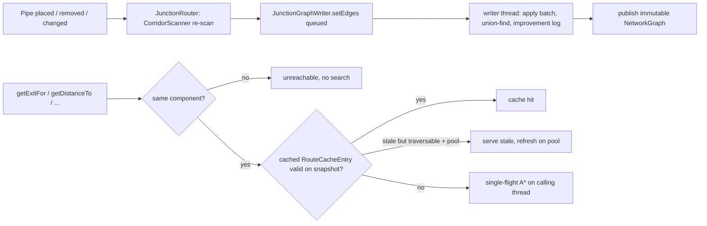

# 03 — Router rework (junction-graph routing)

Compared against `GTNH-origin/master`. Everything here can be checked with
`git diff GTNH-origin/master HEAD -- <path>`. Related areas: pattern crafting
([01-pattern-crafting.md](01-pattern-crafting.md)), request table ([02-request-table.md](02-request-table.md)), item
transport ([04-item-transport.md](04-item-transport.md)), GUIs ([05-modularui-gui.md](05-modularui-gui.md)), and
modules/pipes/compat/build ([06-modules-pipes-compat-build.md](06-modules-pipes-compat-build.md)).

## Overview

**Upstream** gives every routed pipe a `ServerRouter`, which is a link-state router. When a router's neighbourhood
changes, it publishes its adjacency to a shared link-state database and bumps a network-wide version. After that,
every router in the network rebuilds its own full routing table with Dijkstra (`CreateRouteTable`), either on
`RoutingTableUpdateThread`s or inline when a query finds its table out of date. One edit therefore costs one full
Dijkstra per router in the network. Benchmark §"Reference" in
[benchmark-results.md](../router-rework/benchmark-results.md) puts this at about 2.1–2.4 s of total work per edit on a
50k-pipe synthetic network.

**Now** the server uses a `JunctionRouter` for every routed pipe. Each router is a *junction* in one shared, immutable
graph. The runs of plain pipe between routers are compressed into directed *corridor* edges. No router builds a routing
table:

1. A router re-scans only its own corridors, on the same triggers as before (change listeners, the periodic refresh,
   neighbour removal). It then hands the corridors to a single graph writer.
2. The writer applies queued edits in batches. It keeps connected components in a union-find and records which edits
   could have *shortened* a route (the "improvement log"). Each batch is published as a new immutable `NetworkGraph`
   snapshot through an atomic reference swap.
3. Queries are lazy and cached per (source, destination) pair. A cached route is reused for as long as it can be proven
   still optimal on the current snapshot. Otherwise one A* search (Dijkstra plus a scaled Manhattan heuristic) runs
   over the junction graph. Concurrent searches for the same pair share one run ("single-flight").

The work target is ~50k pipes, with routing well under one 50 ms tick.
[benchmark-results.md](../router-rework/benchmark-results.md) gives these figures for 50,544 pipes / 1,087 junctions.
They are the doc's numbers; I did not re-run them:

| What | Figure |
|---|---|
| Cold pair query | p50 125 µs, p99 1.5 ms |
| Cached pair query | p50 0.5 µs |
| Break-pipe graph edit + publish | p50 87–195 µs, p99 about 3 ms |

The design notes live in [docs/router-rework/](../router-rework/):
[developer-guide.md](../router-rework/developer-guide.md), [code-review-guide.md](../router-rework/code-review-guide.md),
[agent-implementation-brief.md](../router-rework/agent-implementation-brief.md) and
[benchmark-results.md](../router-rework/benchmark-results.md). This file describes what the code actually does.

---

# Features

## Junction router (`IRouter` adapter)

**Classes:** [JunctionRouter](../../src/main/java/logisticspipes/routing/astar/JunctionRouter.java),
[JunctionRouterManager](../../src/main/java/logisticspipes/routing/astar/JunctionRouterManager.java),
[RouterIds](../../src/main/java/logisticspipes/routing/astar/RouterIds.java)

- **Wiring.** `LogisticsPipes.init` now installs `new JunctionRouterManager()` instead of `new RouterManager()`.
  `JunctionRouterManager extends RouterManager`. On the server, `getOrCreateRouter` creates `JunctionRouter`s. Client
  routers, direct connections (ISC) and security stations are inherited unchanged. The manager keeps its own
  `routersServer` list, a UUID→id map and a `dimension → packed position → router` index, so loading n pipes no longer
  costs n linear scans (bug-list B10).
- **Ids.** `RouterIds` is the simple-id allocator, the same BitSet scheme as upstream `ServerRouter`. The simple id
  doubles as the `JunctionId`, which is a dense array index in the graph. `RouterIds.getBiggestSimpleID()` replaces
  `ServerRouter.getBiggestSimpleID()` at every caller that sizes a BitSet.
- **What is a port of `ServerRouter`.** The following are ported nearly line for line:
  - pipe cache with `WeakReference`
  - change listeners
  - `recheckAdjacent`, including the `MAX_UNROUTED_CONNECTIONS` per-side limit and the security-station side
    disconnection
  - flood re-check of neighbours on `destroy()`
  - queued tasks
  - `isRoutedExit`, `isSubPoweredExit`, `getRoutersOnSide`
  - interest updates every `REFRESH_TIME` = 20 ticks
- **What is new.**
  - **Activity reporting.** `setPipeCache` and `clearPipeCache` call `writer.setActive(id, …)`, so searches skip
    junctions whose pipe isn't loaded.
  - **`publishCorridors()`.** Turns the scanned `ExitRoute`s into `EdgeSpec`s and calls `writer.setEdges`. It also
    publishes `PowerData` when the attached power providers changed.
  - **Query methods built on the engine:**
    - `getExitFor`, `hasRoute` and `getDistanceTo` → `engine.findRoute`
    - `getDistancesTo(Collection)` → `engine.findRoutesToTargets`, the one-to-many search
    - `getIRoutersByCost` and `getRouteTable` → `engine.sweep`, a whole-network view
    - `getPowerProvider` and `getSubSystemPowerProvider` → `PowerView`
  - **`ExitRoute` conversion.** Results are converted back to `ExitRoute`s once per cache entry and stored as the
    entry's "adapter view" (`PairView`, `SweepView`).
  - **`getRouteFor(id, active, type)`.** Returns the whole `RouteLabel`, meaning the corridor sequence. Item
    transport uses it for scheduled corridor hops ([04-item-transport.md](04-item-transport.md)).
  - **No-op and redirected methods.** `flagForRoutingUpdate()` does nothing. `forceLsaUpdate()` (routing laser /
    manual refresh) becomes `writer.invalidateComponent(id)`.
  - **Before every query, `ensureConnectionsFresh()`** re-scans first if a change listener has fired.
- **Behaviour differences.** The following are listed in code-review-guide §4.4 and I confirmed them in code:
  - Request-only and power-only corridors are weighted by their real length (`CorridorScanner.metricOf`) instead of
    the routable distance.
  - The search never routes a junction to itself through a loop.
  - Power tables are ordered by the distance to each power junction.
- **Compatibility.** `IRouter` is unchanged and router UUIDs are still the persisted identity. Routing adds no new NBT,
  so existing worlds load as before. Code that casts `getRouter()` to `ServerRouter` no longer works on the server.
  `CoreRoutedPipe.doDebugStuff` and `RoutingUpdateTargetResponse` were updated for this. The other in-repo uses that
  needed changing moved to `JunctionRouter` (`RequestTreeNode`, `PipeTransportLogistics`).

## Corridor scanning

**Classes:** [CorridorScanner](../../src/main/java/logisticspipes/routing/astar/CorridorScanner.java)

- `CorridorScanner` is a port of the corridor-discovery half of `PathFinder`. It does a bounded DFS from a routed
  pipe and stops at the next routed pipes. It is bounded by `LOGISTICS_DETECTION_COUNT` = 100 pipes visited and
  `LOGISTICS_DETECTION_LENGTH` = 50 run length.
- Kept from `PathFinder`:
  - special pipe connections (tesseracts and the like)
  - `IRouteProvider`
  - ISC direct connections and their resistance
  - network-dividing, power-only and one-way pipes
  - firewall filters
  - power provider and sub-system power provider discovery
  - change-listener registration
- Added per found corridor:
  - `chunksOf(route)`: chunk keys of every pipe on the path. These feed the `ChunkEdgeIndex`.
  - `metricOf(route)`: the real length, set even when the corridor lacks `canRouteTo`.
  - `travelPathOf(route)`: the ForgeDirection taken at each pipe. It is only set when the corridor is plain LP pipe
    (`opaqueHops == 0`: no special connection, no foreign pipe, no ISC). Item transport uses this to teleport items
    across a corridor as one scheduled hop. `NetworkGraph.hopStillValid` re-checks the hop against the current edge.
- `JunctionRouter.recheckAdjacent` also compares travel paths. `ExitRoute.equals` ignores which pipes a corridor runs
  through, so without this check a swapped pipe would not republish the corridor.

## Graph writer and immutable snapshots

**Classes:**
- [JunctionGraphWriter](../../src/main/java/logisticspipes/routing/astar/JunctionGraphWriter.java)
- [NetworkGraph](../../src/main/java/logisticspipes/routing/astar/NetworkGraph.java)
- [JunctionNode](../../src/main/java/logisticspipes/routing/astar/JunctionNode.java)
- [CorridorEdge](../../src/main/java/logisticspipes/routing/astar/CorridorEdge.java)
- [EdgeSpec](../../src/main/java/logisticspipes/routing/astar/EdgeSpec.java)
- [JunctionId](../../src/main/java/logisticspipes/routing/astar/JunctionId.java)
- [UnionFind](../../src/main/java/logisticspipes/routing/astar/UnionFind.java)
- [ComponentInfo](../../src/main/java/logisticspipes/routing/astar/ComponentInfo.java)
- [ImprovementEvent](../../src/main/java/logisticspipes/routing/astar/ImprovementEvent.java)

**Edits**
- **Edit API.** Edits are queued as `Mutation`s in a `ConcurrentLinkedQueue`:
  - `addJunction`, `removeJunction`
  - `setEdges`: replace all corridors leaving a junction
  - `setActive`, `setData`
  - `invalidateComponent`
  - `splitCorridor`, `mergeThrough`
- **Applying a batch.** `flush()` takes a `ReentrantLock`, applies everything queued, and publishes **one** snapshot
  per batch. In async mode the dedicated writer thread does this. It wakes on submit, or after at most 50 ms idle.
  In sync mode (and in tests) the submitting thread does it.
- **Diffing in `doSetEdges`.** A corridor to the same target with identical content keeps its id and version. A
  changed one keeps its id and gets `version + 1`. A new one gets a fresh id; the edge id encodes the owner junction
  in its high 32 bits, so `NetworkGraph.edge(id)` needs no global map.

**Improvement log**
- Only changes that can make *some* route shorter or possible are logged as `ImprovementEvent`s:
  - a new corridor
  - a corridor that got cheaper, gained a flag, or changed its filters
  - a junction that was added or re-activated
  - power data
  - a manual refresh (`ALL`)
- Each component keeps the log newest-first. It is capped at 256 entries; when it overflows, the newest 128 are kept
  and an `ALL` marker is appended.
- Changes that only make routes worse are not logged. Routes that use the worsened corridor fail their edge-version
  check instead.

**Components**
- **Merging.** Union-find is union by size, and a slot is never reused. A removed junction can stay inside parent
  chains without being confused with a later junction that reuses its id. This was a real bug and is fixed (see
  benchmark-results "Also fixed").
- **Splitting.** Union-find cannot split. Every pair of junctions that lost a direct connection is therefore checked:
  first for a reverse corridor, then by a bidirectional BFS with a budget of `DETOUR_SEARCH_BUDGET` = 512 junctions.
  Only when both fail is the component re-labelled with a full BFS (`relabel`). The largest resulting part keeps the
  component's identity, stamps and log; the other parts get fresh ones.
- **`ComponentInfo`.** Carries the `identity` (kept across merges and splits), a `changeStamp`, the improvement log,
  and the heuristic scale.

**Publish**
- Publishing is O(junctions). It renumbers live roots densely and computes the per-component heuristic scale:
  `min(weight / manhattan)` over the component's corridors, or 0 when any corridor crosses dimensions.
- It then copies the node array into a new `NetworkGraph` and swaps the reference.
- Readers never block. A query takes one snapshot and reads nothing else.
- **Graph surgery.** `splitCorridor` and `mergeThrough` exist and are unit-tested, but nothing in game calls them. In
  game every structural change arrives as a neighbour re-scan, i.e. a `setEdges` diff.

## Unified A* / Dijkstra search

**Classes:** [JunctionSearch](../../src/main/java/logisticspipes/routing/astar/JunctionSearch.java),
[RouteLabel](../../src/main/java/logisticspipes/routing/astar/RouteLabel.java),
[SearchResult](../../src/main/java/logisticspipes/routing/astar/SearchResult.java),
[RoutingFlags](../../src/main/java/logisticspipes/routing/astar/RoutingFlags.java)

- **One routine for every mode.** `JunctionSearch.search(graph, source, targets, heuristic)`:
  - `heuristic == null`: Dijkstra.
  - `heuristic != null`: A*, using the minimum over targets. It is only used when there are at most
    `MAX_HEURISTIC_TARGETS` = 64 targets.
  - One target: stop when it is settled.
  - Several targets: stop when all are settled (one-to-many).
  - `targets == null`: settle everything reachable (the whole-network sweep).
- **Per-flag semantics, like the old router.**
  - `PipeRoutingConnectionType` becomes the int mask `RoutingFlags`.
  - A flag is *closed* at a junction once a filter-free route delivered it.
  - Filtered routes are kept as alternatives unless an earlier route's filter set is a subset of theirs
    (`hasNewInformation`).
  - Flags are intersected along a route.
  - Entries that can't deliver a still-missing flag are dropped, so a flag that never arrives does not drain the
    component.
- **Heuristic.** `NetworkGraph.manhattanHeuristic()` is the Manhattan distance times the component scale. It stays
  admissible and consistent for Thermal Dynamics ducts, tesseracts and cross-dimension links. The javadoc warns that
  per-axis pipe costs would need a per-axis scale.
- **Hot path.**
  - Per-thread `Scratch`: an index binary heap over primitive arrays, reset through a touched list, so a search costs
    O(visited).
  - The queue arrays shrink back after a pathological search.
  - Ties break by f, then g, then junction index, then push order, so results are deterministic.
- **Results.** `RouteLabel` is a parent-linked label holding distance, flags, `newFlags`, filters, block distance and
  first edge. `SearchResult` holds routes per target, the settle order, unreachable targets and counters.

## Route cache, invalidation and single-flight

**Classes:**
- [JunctionRoutingEngine](../../src/main/java/logisticspipes/routing/astar/JunctionRoutingEngine.java)
- [ValidatedRoutes](../../src/main/java/logisticspipes/routing/astar/ValidatedRoutes.java)
- [RouteCacheEntry](../../src/main/java/logisticspipes/routing/astar/RouteCacheEntry.java)
- [SweepEntry](../../src/main/java/logisticspipes/routing/astar/SweepEntry.java)
- [PairKey](../../src/main/java/logisticspipes/routing/astar/PairKey.java)

**The three query paths**
- **`findRoute(source, dest)`.** Steps, in order:
  1. Union-find pre-check: different components mean unreachable, with no search.
  2. A `ConcurrentHashMap<PairKey, RouteCacheEntry>` lookup.
  3. If the entry is `isValid` on the snapshot, it is a hit.
  4. If it is stale but `isTraversable` and a pool exists, it is served while a background refresh runs.
  5. Otherwise single-flight: a `CompletableFuture` per key, where exactly one thread searches and the rest `join()`.

  On a miss the caller's own thread runs the search. `IRouter` callers can't handle "pending".
- **`findRoutesToTargets(source, targets)`.** Answers cached targets from the cache. All missing targets are resolved
  with **one** multi-target Dijkstra, and the results are stored as ordinary pair entries.
  - Crafting resolution uses it: `RequestTreeNode.routesToInterestedRouters` → `JunctionRouter.getDistancesTo`.
  - So does `PowerView`.
- **`sweep(source)`.** One-to-all, kept for the whole-network parts of `IRouter`: `getIRoutersByCost` and
  `getRouteTable`. These are used by CC broadcast, request GUIs and fluid sink search. Sweeps are cached per source and
  validated like pairs, but any improvement invalidates them.

**Validity (`ValidatedRoutes.isValid`)**
A cached entry is valid when all of these hold:
- the source still exists
- the component identity is the same
- **and either:**
  - the component's change stamp is unchanged, **or**
  - every logged improvement since the entry was computed `survives`, every recorded corridor still has the same
    version, and every recorded corridor leads to an active junction.

**The "ellipse" test (`RouteCacheEntry.survives`)**
- A route through an improved corridor `u→v` costs at least `h(s,u) + w + h(v,t)`.
- If that bound is above `settledAt[flag]` for every flag the corridor can carry, the entry survives. `settledAt[flag]`
  is the cost at which the flag was settled at the destination by a filter-free route.
- Ties invalidate (EPSILON).
- Flags the source cannot emit are masked out.
- `DATA` events (power) never affect pair routes.

**Stale serving**
- `isTraversable` requires every corridor to exist with the same ends, flags, sides and filters, leading to active
  junctions.
- An "unreachable" entry is never served stale. This fixed bug-list B18; the regression test is
  `RouteCacheTest.unreachableIsNeverServedStaleAfterAMerge`.

**Housekeeping**
- After each publish, entries whose source or destination was removed are dropped.
- The whole pair cache is cleared once it exceeds 2^20 entries.
- `/lp rt` statistics: pair, one-to-many and sweep searches, cache hits, stale-served count, and average search time.

## Threading and configuration

**Classes:** [LPJunctionNetwork](../../src/main/java/logisticspipes/routing/astar/LPJunctionNetwork.java),
[JunctionRoutingThread](../../src/main/java/logisticspipes/routing/astar/JunctionRoutingThread.java)

**Startup and shutdown**
- `LPJunctionNetwork` is the static owner of the single writer and engine.
- `LogisticsPipes.init` used to start `Configs.MULTI_THREAD_NUMBER` × `RoutingTableUpdateThread`. It now calls
  `LPJunctionNetwork.start(MULTI_THREAD_NUMBER, MULTI_THREAD_PRIORITY)`:
  - **`count > 0`:** one writer thread ("LogisticsPipes JunctionGraphWriter"), plus a `ThreadPoolExecutor` of `count`
    threads ("LogisticsPipes RouteRefresh") for background refreshes. The pool has a 4096-entry bounded queue and
    `AbortPolicy`; a rejected refresh just leaves the stale entry.
  - **`count == 0`:** everything runs synchronously on the calling thread.
- On server stop, `LPJunctionNetwork.cleanup()` clears the graph, the cache, `InterestRegistry` and `RouterIds`. The
  worker threads are kept for the next integrated-server session.

**Threads**
- `JunctionRoutingThread` is the thread class for both pools. `MainProxy` treats it as a server thread (one-line
  change, in another area's file list).
- The world is read only on the server thread: corridor scans run in `update()` and in `ensureConnectionsFresh()`.
  Background threads only read snapshots.
- **Timing of edits in async mode.** A query issued in the same tick as an edit may still see the previous snapshot
  until the writer thread drains its queue.

## Power provider routing

**Classes:** `JunctionRouter.PowerData` / `PowerView`,
[LogisticsPowerProviderTileEntity](../../src/main/java/logisticspipes/blocks/powertile/LogisticsPowerProviderTileEntity.java)

- **Where provider data lives.** Power providers (power junction / power provider blocks, sub-system providers) found
  by a corridor scan are stored as **junction data** (`writer.setData`). Only junctions that have providers attached
  carry data. `NetworkGraph.dataJunctionsInComponentOf` lists them.
- **How a pipe builds its tables.** `getPowerProvider()` and `getSubSystemPowerProvider()` build a `PowerView`:
  1. Run one `findRoutesToTargets` to just those data junctions.
  2. Add the providers of each reachable junction whose route has `CAN_POWER_FROM` or `CAN_POWER_SUB_SYSTEM_FROM`,
     closest first, with the route's filters appended.
- **Reuse while nothing changed.** Every routed pipe polls power every 10 ticks (`checkTexturePowered` →
  `canUseEnergy`). The view is therefore reused while two things hold:
  - the graph snapshot is the same object
  - the pipe's own power lists are the same
  It is only tied to a snapshot when all its routes are valid on that snapshot (B18 fix).
- **Before and after.** benchmark-results §7 compares the older approach (power tables from the whole-network sweep)
  with pair routes to the power junctions. On the 50k network with 5 power junctions, the work for **all** routers per
  placement went from a 1,631 ms mean to a 396 ms mean. That work runs on the refresh pool, not on the tick.
  [lag-investigation.md](../lag-investigation.md) §4 documents the later snapshot-reuse fast path.
- `LogisticsPowerProviderTileEntity`: the only change is `ServerRouter.getBiggestSimpleID()` →
  `RouterIds.getBiggestSimpleID()` when sizing the `reOrdered` BitSet.

## Interest registry

**Classes:** [InterestRegistry](../../src/main/java/logisticspipes/routing/astar/InterestRegistry.java),
[LogisticsManager](../../src/main/java/logisticspipes/logistics/LogisticsManager.java)

- The static "who is interested in item X" tables (specific interests per `ItemIdentifier`, plus generic interests)
  moved out of `ServerRouter` into `InterestRegistry`. Behaviour is unchanged, including the damage, NBT and data
  wildcard lookups and `DictResource` matching.
- `JunctionRouter.updateInterests` feeds the registry.
- Callers switched from `ServerRouter.getRoutersInterestedIn` to `InterestRegistry.getRoutersInterestedIn`:
  - `LogisticsManager`
  - `RequestTreeNode`
  - `ModuleCCBasedQuickSort`
  - `CoreRoutedPipe.doDebugStuff`

## In-transit tracking

**Classes:** [InTransitTracker](../../src/main/java/logisticspipes/routing/InTransitTracker.java),
[LogisticsManager](../../src/main/java/logisticspipes/logistics/LogisticsManager.java),
[ILogisticsManager](../../src/main/java/logisticspipes/logistics/ILogisticsManager.java)

**`InTransitTracker`**
- Replaces `CoreRoutedPipe._inTransitToMe`, which was a `PriorityBlockingQueue<ItemRoutingInformation>` ordered by
  timeout. The new structure is:
  - a `LinkedHashSet` of entries
  - an identity map from each entry to the item it was indexed under
  - an index `ItemIdentifier → Set<entry>`
- Costs:
  - add and remove are O(1)
  - `count(item)`, which backs `countOnRoute`, is O(entries of that item) instead of a scan over everything in transit
  - iteration works on a copy
  - all methods are `synchronized`
- Timed-out entries are dropped by `removeTimedOut` every 20 ticks (`isNthTick(20)`). Upstream polled the queue head
  every tick.

**Count changes in `LogisticsManager` and `CoreRoutedPipe`**
- `assignDestinationFor` now calls `notifyOfRerouteTo` on the new destination when it reroutes an item. That way the
  item counts as in transit there, and sinks don't promise the same room twice.
- New `ILogisticsManager.assignDefaultRouteFor(item, sourceRouterId)` / `LogisticsManager.assignDefaultRouteFor`:
  - It is the last effort before an item that found no destination is dropped.
  - It picks the nearest passive **default-route** sink with physical room, called with `includeInTransit = false`.
  - It honours route filters, and also registers the item as in transit.
  - It is called from `PipeTransportLogistics` ([04-item-transport.md](04-item-transport.md)). Bug-list B19/B20 are
    the in-game cases.
- `CoreRoutedPipe` (another area's file) now also counts items that are still in its own send queue as in transit to
  their destination:
  - `addToSendQueue` / `trackQueuedSend`
  - `refreshSendQueueTracking` every tick while the send queue is non-empty
  - `clearSendQueue` on NBT load

  The API change: `ILogisticsManager` gained a method. Any external implementation of the interface would need to add
  it. Within this repo only `LogisticsManager` implements it.

## Fluid destination search

**Classes:** [LogisticsFluidManager](../../src/main/java/logisticspipes/logistics/LogisticsFluidManager.java)

- `getBestReply` still walks `getIRoutersByCost()`, which is a whole-network sweep under the junction router.
- It now skips `PipeItemsPatternCraftingLogistics` and `PipeItemsPatternSatelliteLogistics` as passive fluid sinks.
  The pattern pipes are described in [01-pattern-crafting.md](01-pattern-crafting.md).
- The rest of the diff is a reformat: one-line `continue`s and a pattern-matching `instanceof`.

## Chunk unload handling

**Classes:** [ChunkEdgeIndex](../../src/main/java/logisticspipes/routing/astar/ChunkEdgeIndex.java),
`LPJunctionNetwork.onChunkUnload`

- `ChunkEdgeIndex` maps a chunk key (dimension, cx, cz packed into a long) to the ids of the corridors passing through
  that chunk. Only the writer mutates it; it is backed by a `ConcurrentHashMap`. It is a lookup accelerator only and
  never invalidates routes.
- The new `LogisticsEventListener.chunkUnload` handler (`ChunkEvent.Unload`, server only) calls
  `LPJunctionNetwork.onChunkUnload`. For every corridor through that chunk, the owner junction gets
  `scheduleCorridorRecheck()`, unless the owner itself sits in that chunk. The owner then re-scans on its next ticks.
- Upstream kept corridors through unloaded chunks. code-review-guide §4.4 notes that whether the re-scan sees the cut
  depends on the neighbour tile cache.

## Router lookup indexes

**Classes:** [RouterManager](../../src/main/java/logisticspipes/routing/RouterManager.java)

- **Client side.** `getOrCreateRouter` used to scan `_routersClient` linearly for every pipe. It now uses
  `_routersClientByPos`, keyed by packed position only. The comment explains why: `ClientRouter.isAt` ignores the
  dimension, and the list is cleared on every client world load. `clearClientRouters` clears both.
- **`packPosition(x, y, z)`.** A new protected static helper: 26 bits each for x and z, 12 bits for y. The server-side
  index in `JunctionRouterManager` uses it too.
- **Unchanged.** The server path of the base class still creates `ServerRouter`s, but it is only reached if
  `RouterManager` is instantiated directly, which no code does any more.

## Diagnostics: commands and routing debug

**Classes:** [RoutingThreadCommand](../../src/main/java/logisticspipes/commands/commands/RoutingThreadCommand.java),
[RoutingThreadClearCommand](../../src/main/java/logisticspipes/commands/commands/RoutingThreadClearCommand.java),
[RoutingUpdateTargetResponse](../../src/main/java/logisticspipes/network/packets/routingdebug/RoutingUpdateTargetResponse.java)

**Commands**
- **`/lp routingthread`, `/lp rt`.** It used to print `RoutingTableUpdateThread` queue size and average time. It now
  prints `LPJunctionNetwork.describe()`:
  - junction, corridor and generation counts, plus pending edits
  - cached pairs and network views, hits, stale-served count
  - pair, one-to-many and network-view search counts, and the average search time in µs
  - logged improvements by kind, and cut handling (detour found vs full re-label)

  It is usable by everyone, as before.
- **`/lp routingthread-clear`, `/lp rt-clear` (new).** Zeros those counters. Cached routes and the graph are kept.
  It is usable by everyone and is registered in `MainCommandHandler`, which is outside this file list. That handler
  also registers `PipeSpeedCommand`, which belongs to the transport area.

**Routing debug**
- **Routing-table step debugger** (`RoutingUpdateTargetResponse`). If the targeted pipe's router is not a
  `ServerRouter`, it now prints "RoutingTable debug is not available for the junction-graph router" instead of
  throwing a `ClassCastException`. Every server router is now a `JunctionRouter`, so in practice the step debugger is
  unavailable.
- **`CoreRoutedPipe.doDebugStuff`** (debug right-click). It accepts both router types and reads interests from
  `InterestRegistry`. For a `JunctionRouter` it prints `describe()` and calls `recomputeNetworkView()`, which
  invalidates the component, flushes the writer and recomputes the sweep.

## Tests and benchmarks

Location: [src/test/java/logisticspipes/routing/astar/](../../src/test/java/logisticspipes/routing/astar/). These are
JUnit 5 tests and run with the normal `test` task. None of them is tagged or excluded, so the 50k-pipe perf and
benchmark classes run too. They exercise the pure-Java core, so no Minecraft classes are needed, by driving
`JunctionGraphWriter` in synchronous mode.

- **[TestNetworks](../../src/test/java/logisticspipes/routing/astar/TestNetworks.java)** is a helper, not a test. It
  builds graphs through the writer and provides a brute-force reference shortest path.
- **[JunctionGraphWriterTest](../../src/test/java/logisticspipes/routing/astar/JunctionGraphWriterTest.java)** covers:
  - split and merge surgery (weights preserved or summed, non-pass-through merge refused)
  - unchanged corridors keep their id and version
  - component split, and a cut with a detour that needs no full re-label
  - a reused id does not inherit the old component
  - corridors into a removed junction are dropped
  - chunk index lookup
  - improvement vs change stamps
  - async writer publishing
- **[JunctionSearchTest](../../src/test/java/logisticspipes/routing/astar/JunctionSearchTest.java)** covers:
  - loop choice and flip on a weight change
  - the cross-component short-circuit
  - filtered route alternatives
  - flag intersection
  - random graphs vs the reference, per flag
  - heuristic and target set never change the answer
  - one-to-many stops early
  - A* explores less than Dijkstra
  - Manhattan admissibility
  - inactive junctions are skipped
- **[RouteCacheTest](../../src/test/java/logisticspipes/routing/astar/RouteCacheTest.java)** covers:
  - cache hits
  - a worsened edge invalidates only the routes that use it
  - near improvements invalidate, far ones don't (ellipse test)
  - other components are untouched
  - single-flight runs exactly one search
  - stale-but-traversable entries are served with a refresh
  - broken routes are never served stale
  - unreachable entries are never served stale after a merge (B18)
  - one-to-many fills the pair cache
  - randomized edit fuzz test: cached answers vs fresh searches
- **[TravelPathTest](../../src/test/java/logisticspipes/routing/astar/TravelPathTest.java)** covers:
  - travel paths are joined on merge, and become opaque if one half is opaque
  - a travel-path change bumps the edge version
  - `hopStillValid`
- **[JunctionPerfTest](../../src/test/java/logisticspipes/routing/astar/JunctionPerfTest.java)** builds synthetic
  10k and 50k pipe grids, compressed the way the scanner does it. It prints query and edit latencies and asserts only
  correctness. It also gives the old link-state reference figure.
- **[JunctionBenchmarkTest](../../src/test/java/logisticspipes/routing/astar/JunctionBenchmarkTest.java)** produces
  the latency tables in [benchmark-results.md](../router-rework/benchmark-results.md):
  - pair queries, cold and hot
  - one-to-many
  - break/place edits
  - power polling while building
  - 20-thread parallel stress, with and without concurrent edits

  The doc gives the command:
  `./gradlew test --tests 'logisticspipes.routing.astar.JunctionBenchmarkTest' -i`.

**Not covered by automated tests:** the Minecraft adapter. That includes `JunctionRouter`, `CorridorScanner`,
`JunctionRouterManager`, `PowerView`, the chunk-unload hook, `InTransitTracker` and `assignDefaultRouteFor`.

## Documentation added

- **[docs/router-rework/agent-implementation-brief.md](../router-rework/agent-implementation-brief.md)**: the original
  spec. It covers junction compression, edge versioning, the unified search, one-to-many, single-flight and
  acceptance tests.
- **[docs/router-rework/developer-guide.md](../router-rework/developer-guide.md)**: concepts and rationale (A* as
  Dijkstra plus a heuristic, the Manhattan heuristic, why loops rule out tree shortcuts, one-to-many), and the testing
  strategy.
- **[docs/router-rework/code-review-guide.md](../router-rework/code-review-guide.md)**: a class-by-class map,
  correctness arguments, deliberate deviations from the spec, player-visible changes, threading, known limitations,
  and the effect of the rework design decisions.
- **[docs/router-rework/benchmark-results.md](../router-rework/benchmark-results.md)**: benchmark setup and results,
  the before/after for the split check and improvement log, and power polling.
- **[docs/ITEM_ROUTING.md](../ITEM_ROUTING.md)**: how items get destinations and next hops, failure handling, and
  in-transit tracking. It is written against the upstream `ServerRouter`; see the gaps below.
- **[docs/lag-investigation.md](../lag-investigation.md)**: lag found by reading code (2026-09-29). It covers per-hop
  routing cost, particles, client FPS, and the per-pipe idle cost (hard-coded `LPConstants.DEBUG`, power-view polling).

---

# Changes to upstream classes

| Class | Change | Why |
|---|---|---|
| `LogisticsPowerProviderTileEntity` | `ServerRouter.getBiggestSimpleID()` → `RouterIds.getBiggestSimpleID()` | The id allocator moved to `RouterIds` |
| `RoutingThreadCommand` | Prints `LPJunctionNetwork.describe()` instead of `RoutingTableUpdateThread` stats | The table threads are no longer started |
| `ILogisticsManager` | New `assignDefaultRouteFor(IRoutedItem, int)` | Last-resort default route before an item is dropped |
| `LogisticsManager` | `InterestRegistry` / `RouterIds` replace `ServerRouter` statics; reroute registers in-transit at the new destination; `assignDefaultRouteFor` implementation | Junction router owns interests and ids; stop over-promising sink room; B19/B20 |
| `LogisticsFluidManager` | Skips pattern crafting and pattern satellite pipes as fluid sinks; reformat | Pattern pipes must not take passive fluids |
| `RoutingUpdateTargetResponse` | Refuses with a chat message when the router isn't a `ServerRouter` | The step debugger only works on link-state tables; avoids a `ClassCastException` |
| `RouterManager` | Client position index `_routersClientByPos`, `packPosition` helper | O(1) client router lookup on chunk load (B10) |
| `ServerRouter` | `updateInterests` copies the pipe's interest set into `_hasInterestIn` instead of aliasing it; two `instanceof` pattern-variable cleanups | Pipes may return cached or immutable sets. Note that `ServerRouter` is no longer used on the server, see the gaps below |
| `LPTickHandler` | Client tick calls `CraftingRequestDebugClient.clientTick(event)` | Crafting-request debug client ([01](01-pattern-crafting.md)/[02](02-request-table.md)); not routing |

Wiring changes outside this file list, for reference:
- `LogisticsPipes`: `JunctionRouterManager`, `LPJunctionNetwork.start` / `cleanup`.
- `LogisticsEventListener.chunkUnload`.
- `MainProxy`: `JunctionRoutingThread` counts as a server thread.
- `CoreRoutedPipe`: `InTransitTracker`, send-queue tracking, debug output.
- `RequestTreeNode.routesToInterestedRouters`: one-to-many.
- `PipeTransportLogistics` and `ClumpTransit`: corridor hops.
- `MainCommandHandler`: registers `rt-clear`.

---

# Known gaps / discrepancies

These are things I observed in the code. Nothing here was tested in game.

1. **`JunctionRouter.updateInterests` still aliases the pipe's interest set.** It does
   `_hasInterestIn = newInterests` (`JunctionRouter.java` ~line 1157). The aliasing fix in this diff was applied to
   `ServerRouter`, which is no longer instantiated on the server, not to `JunctionRouter`. The problem case:
   - `PipeItemsPatternCraftingLogistics.getSpecificInterests()` returns `PatternHandler`'s
     `Collections.unmodifiableSet`.
   - `JunctionRouter.removeAllInterests()` (from `destroy()` and `clearInterests()` / dimension unload) then calls
     `_hasInterestIn.clear()`.
   - That should throw `UnsupportedOperationException` for a pattern crafting pipe whose interest set had been adopted
     (non-empty outputs).

   Porting the `ServerRouter` change, which copies into the router's own set, fixes it.
2. **[docs/ITEM_ROUTING.md](../ITEM_ROUTING.md) describes the upstream link-state router.** It mentions
   `ServerRouter.CreateRouteTable`, the link-state database, `RoutingTableUpdateThread` and
   `ensureRouteTableIsUpToDate`. Its source map points to `ServerRouter` / `PathFinder`. None of these is the active
   path any more. Its in-transit section also predates `InTransitTracker` (timeouts are now swept every 20 ticks).
3. **The config comment for `multithread.count` is out of date.** It still reads "Number of routing table update
   Threads, 0 to disable." It now sets the size of the route-refresh pool, and any value > 0 also starts the writer
   thread.
4. **Dead legacy code is still in the tree.** `ServerRouter`, `RoutingTableUpdateThread` and the server branch of
   `RouterManager.getOrCreateRouter` remain. `LogisticsPipes.cleanup` still calls `ServerRouter.cleanup()`. `PathFinder`
   is still used by the routing-laser packet and `messureDistanceToNextRoutedPipe`. `MainProxy` still recognises
   `RoutingTableUpdateThread`.
5. **The routing-table step debugger** (`/lp` routing debug target) is effectively unavailable, because every server
   router is a `JunctionRouter`.
6. **Graph surgery APIs are unused in game.** `splitCorridor` and `mergeThrough` are only called from tests.
7. **Unbounded growth.**
   - Union-find slots are never reused. A new slot is used per junction ever added and per re-labelled part. Only
     server stop compacts them.
   - The pair cache has no age-based eviction. It drops entries of removed junctions, and drops everything above
     2^20 entries.
   - The removal sweep in `JunctionRoutingEngine.onPublish` is a `removeIf` over the whole pair cache on every publish
     that removed a junction. That runs on the writer thread, or on the tick when `count = 0`.
8. **`findRoutesToTargets` is not single-flighted.** Concurrent one-to-many queries for the same missing targets each
   run their own search. Only `findRoute` and `sweep` use single-flight.
9. **Whole-network views are invalidated by any improvement in the network.** `SweepEntry.survives` is always false.
   They are still used by `getIRoutersByCost` callers: fluid destination search, CC broadcast/message, and GUIs.
10. **A cache miss runs on the caller's thread**, which in game is usually the server tick. The benchmark doc's cold
    p99 is ~1.5 ms per pair, and up to ~2 ms for one-to-many with random targets, on the 50k grid.
    [lag-investigation.md](../lag-investigation.md) §1 notes that each item hop makes 3 `hasRoute` calls plus a
    `getExitFor`. Each of those is a cache lookup with a `PairKey` allocation.
11. **Benchmarks run in the normal `test` task.** There is no tag or exclusion, so the 50k-network build and the
    benchmark loops add to every test run.
12. **Cosmetic.** Two orphaned javadoc comments: the `fullRelabels` doc sits above `improvementCounts()` in
    `JunctionGraphWriter`, and a "Chunks the corridor…" stub sits above `metricOf` in `CorridorScanner`.

---

# Files

| Class/file | Status | +/- | Summary |
|---|---|---|---|
| **docs** | | | |
| [docs/ITEM_ROUTING.md](../ITEM_ROUTING.md) | A | +323/-0 | Item destination/next-hop/failure handling write-up; describes upstream `ServerRouter` |
| [docs/lag-investigation.md](../lag-investigation.md) | A | +216/-0 | Code-reading lag analysis: per-hop routing, particles, client FPS, idle per-pipe cost |
| [docs/router-rework/agent-implementation-brief.md](../router-rework/agent-implementation-brief.md) | A | +214/-0 | Original implementation spec for the junction-graph engine |
| [docs/router-rework/benchmark-results.md](../router-rework/benchmark-results.md) | A | +122/-0 | 50k-pipe benchmark results, edit fixes before/after, power polling |
| [docs/router-rework/code-review-guide.md](../router-rework/code-review-guide.md) | A | +266/-0 | Class map, correctness arguments, deviations, limitations, design-decision effects |
| [docs/router-rework/developer-guide.md](../router-rework/developer-guide.md) | A | +276/-0 | Concepts and rationale: junctions, A*/Dijkstra, heuristic, one-to-many, testing |
| **logisticspipes.blocks.powertile** | | | |
| [LogisticsPowerProviderTileEntity](../../src/main/java/logisticspipes/blocks/powertile/LogisticsPowerProviderTileEntity.java) | M | +2/-2 | BitSet sized from `RouterIds` instead of `ServerRouter` |
| **logisticspipes.commands.commands** | | | |
| [RoutingThreadClearCommand](../../src/main/java/logisticspipes/commands/commands/RoutingThreadClearCommand.java) | A | +31/-0 | `/lp rt-clear`: reset junction-router statistics |
| [RoutingThreadCommand](../../src/main/java/logisticspipes/commands/commands/RoutingThreadCommand.java) | M | +4/-6 | `/lp rt` prints junction graph / cache / search / edit statistics |
| **logisticspipes.logistics** | | | |
| [ILogisticsManager](../../src/main/java/logisticspipes/logistics/ILogisticsManager.java) | M | +6/-0 | New `assignDefaultRouteFor` last-resort method |
| [LogisticsFluidManager](../../src/main/java/logisticspipes/logistics/LogisticsFluidManager.java) | M | +9/-15 | Skip pattern crafting/satellite pipes as fluid sinks; reformat |
| [LogisticsManager](../../src/main/java/logisticspipes/logistics/LogisticsManager.java) | M | +68/-10 | `InterestRegistry`/`RouterIds`; in-transit on reroute; default-route fallback |
| **logisticspipes.network.packets.routingdebug** | | | |
| [RoutingUpdateTargetResponse](../../src/main/java/logisticspipes/network/packets/routingdebug/RoutingUpdateTargetResponse.java) | M | +30/-22 | Step debugger refuses non-`ServerRouter` routers with a message |
| **logisticspipes.routing** | | | |
| [InTransitTracker](../../src/main/java/logisticspipes/routing/InTransitTracker.java) | A | +103/-0 | Indexed in-transit set: O(1) add/remove, per-item counts, timeout sweep |
| [RouterManager](../../src/main/java/logisticspipes/routing/RouterManager.java) | M | +13/-4 | Client router position index; `packPosition` helper |
| [ServerRouter](../../src/main/java/logisticspipes/routing/ServerRouter.java) | M | +11/-11 | Copy interest set instead of aliasing; pattern-matching cleanups (class now unused on server) |
| **logisticspipes.routing.astar** | | | |
| [ChunkEdgeIndex](../../src/main/java/logisticspipes/routing/astar/ChunkEdgeIndex.java) | A | +64/-0 | Chunk → corridor-edge ids index for chunk-unload rechecks |
| [ComponentInfo](../../src/main/java/logisticspipes/routing/astar/ComponentInfo.java) | A | +43/-0 | Per-component identity, change stamp, improvement log, heuristic scale |
| [CorridorEdge](../../src/main/java/logisticspipes/routing/astar/CorridorEdge.java) | A | +72/-0 | Immutable directed corridor with id, version, flags, filters, chunks, travel path |
| [CorridorScanner](../../src/main/java/logisticspipes/routing/astar/CorridorScanner.java) | A | +461/-0 | `PathFinder` port: corridor discovery plus chunks, real metric, travel paths |
| [EdgeSpec](../../src/main/java/logisticspipes/routing/astar/EdgeSpec.java) | A | +74/-0 | Scanned corridor description; `sameContent` / `improvesOn` diff helpers |
| [ImprovementEvent](../../src/main/java/logisticspipes/routing/astar/ImprovementEvent.java) | A | +69/-0 | Newest-first per-component log of route-improving edits, truncated at 256 |
| [InterestRegistry](../../src/main/java/logisticspipes/routing/astar/InterestRegistry.java) | A | +110/-0 | Global item-interest tables moved out of `ServerRouter` |
| [JunctionGraphWriter](../../src/main/java/logisticspipes/routing/astar/JunctionGraphWriter.java) | A | +1023/-0 | Single writer: batched edits, union-find, split detection, improvement log, snapshot publish |
| [JunctionId](../../src/main/java/logisticspipes/routing/astar/JunctionId.java) | A | +64/-0 | Junction identity (= router simple id), cached small values |
| [JunctionNode](../../src/main/java/logisticspipes/routing/astar/JunctionNode.java) | A | +127/-0 | Immutable junction: position, outgoing corridors, active flag, payload, data |
| [JunctionRouter](../../src/main/java/logisticspipes/routing/astar/JunctionRouter.java) | A | +1214/-0 | `IRouter` on the junction graph: scans, publishes corridors, cached queries, power view |
| [JunctionRouterManager](../../src/main/java/logisticspipes/routing/astar/JunctionRouterManager.java) | A | +171/-0 | Router manager creating `JunctionRouter`s, with UUID and position indexes |
| [JunctionRoutingEngine](../../src/main/java/logisticspipes/routing/astar/JunctionRoutingEngine.java) | A | +401/-0 | Pair/one-to-many/sweep route cache, validation, single-flight, background refresh, stats |
| [JunctionRoutingThread](../../src/main/java/logisticspipes/routing/astar/JunctionRoutingThread.java) | A | +22/-0 | Daemon thread type and factory for writer and refresh pool |
| [JunctionSearch](../../src/main/java/logisticspipes/routing/astar/JunctionSearch.java) | A | +479/-0 | Unified per-flag A*/Dijkstra, one/many/all targets, allocation-light heap |
| [LPJunctionNetwork](../../src/main/java/logisticspipes/routing/astar/LPJunctionNetwork.java) | A | +90/-0 | Static owner: start threads, cleanup, chunk-unload hook, stats |
| [NetworkGraph](../../src/main/java/logisticspipes/routing/astar/NetworkGraph.java) | A | +249/-0 | Immutable snapshot: nodes, components, scaled Manhattan heuristic, hop validation |
| [PairKey](../../src/main/java/logisticspipes/routing/astar/PairKey.java) | A | +39/-0 | (source, destination) route-cache key |
| [RouteCacheEntry](../../src/main/java/logisticspipes/routing/astar/RouteCacheEntry.java) | A | +98/-0 | Cached pair routes with per-flag settle cost and the ellipse survival test |
| [RouteLabel](../../src/main/java/logisticspipes/routing/astar/RouteLabel.java) | A | +102/-0 | One accepted route: distance, flags, filters, parent chain, first edge |
| [RouterIds](../../src/main/java/logisticspipes/routing/astar/RouterIds.java) | A | +36/-0 | Dense router simple-id allocator |
| [RoutingFlags](../../src/main/java/logisticspipes/routing/astar/RoutingFlags.java) | A | +44/-0 | Int bitmask form of `PipeRoutingConnectionType` |
| [SearchResult](../../src/main/java/logisticspipes/routing/astar/SearchResult.java) | A | +50/-0 | Search output: routes per target, settle order, unreachable, counters |
| [SweepEntry](../../src/main/java/logisticspipes/routing/astar/SweepEntry.java) | A | +30/-0 | Cached one-to-all view for legacy whole-network `IRouter` methods |
| [UnionFind](../../src/main/java/logisticspipes/routing/astar/UnionFind.java) | A | +81/-0 | Union-by-size forest with never-reused slots and relabel |
| [ValidatedRoutes](../../src/main/java/logisticspipes/routing/astar/ValidatedRoutes.java) | A | +170/-0 | Base validity/traversability checks against newer snapshots |
| **logisticspipes.ticks** | | | |
| [LPTickHandler](../../src/main/java/logisticspipes/ticks/LPTickHandler.java) | M | +2/-0 | Client tick drives `CraftingRequestDebugClient` (crafting debug, not routing) |
| **tests: logisticspipes.routing.astar** | | | |
| [JunctionBenchmarkTest](../../src/test/java/logisticspipes/routing/astar/JunctionBenchmarkTest.java) | A | +415/-0 | Latency benchmarks on the 50k network (source of benchmark-results.md) |
| [JunctionGraphWriterTest](../../src/test/java/logisticspipes/routing/astar/JunctionGraphWriterTest.java) | A | +277/-0 | Surgery, versions, splits/detours, id reuse, chunk index, stamps, async |
| [JunctionPerfTest](../../src/test/java/logisticspipes/routing/astar/JunctionPerfTest.java) | A | +256/-0 | Synthetic 10k/50k pipe grids; query/edit latency, old-router reference |
| [JunctionSearchTest](../../src/test/java/logisticspipes/routing/astar/JunctionSearchTest.java) | A | +262/-0 | Search correctness, heuristic parity/admissibility, one-to-many, filters, flags |
| [RouteCacheTest](../../src/test/java/logisticspipes/routing/astar/RouteCacheTest.java) | A | +429/-0 | Cache validity, ellipse test, single-flight, stale serving, edit fuzz |
| [TestNetworks](../../src/test/java/logisticspipes/routing/astar/TestNetworks.java) | A | +165/-0 | Test helpers: build graphs via writer, reference shortest path |
| [TravelPathTest](../../src/test/java/logisticspipes/routing/astar/TravelPathTest.java) | A | +88/-0 | Corridor travel paths: merge, opacity, version bump, `hopStillValid` |
